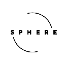

<h1> Sphere Wallet Chrome Extension</h1>

## Intro 
Sphere Wallet Chrome extension is a user-friendly and secure extension designed to simplify interaction with Near Protocol on the Near blockchain network. The extension provides users with the tools they need to create, manage and secure their Near wallet while seamlessly integrating with Near Dapps.

The wallet adheres to [Injected Wallets Standard](https://nomicon.io/Standards/Wallets/InjectedWallets) by injecting in browser under `window.sphere` the wallet object which exposes the methods needed so Dapps can interact with it.

This Chrome extension is developed using React, Typescript and Vite using [chrome-extension-boilerplate-react-vite](https://github.com/Jonghakseo/chrome-extension-boilerplate-react-vite)
## Features 
- User-Friendly interface: Sphere offers an intuitive and easy-to-navigate interface, making it accessible for both beginners and experienced users.
- Wallet Creation: Users can easily create or import a Near wallet and securely manage their seed phrases, private keys and public keys
- Transaction Management: Send and receive Near tokens with ease
- Integration with Dapps: Semlessly interact with Near-powered decentralized applications through the extension, facilitating quick and secure transactions

## Installation 

1. Clone this repository: `git clone https://github.com/stefan-b10/sphere`
2. Navigate to the project directory
3. Install dependencies: `npm install`
4. After all the dependencies are installed build the extension: `npm run build`
5. Load Extension on Chrome
   1. Open - Chrome browser
   2. Access - chrome://extensions
   3. Check - Developer mode
   4. Find - Load unpacked extension
   5. Select - `dist` folder in this project (after dev or build)

## Usage 
- Create a new Near wallet or import an existing one
  

- Delete a account
  

- Make a Near transfer
  

